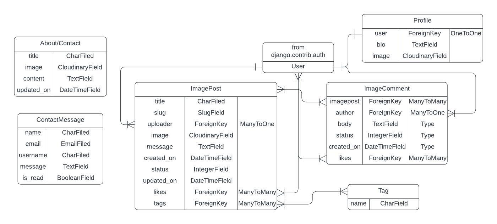

# Love Japan

Love Japan is an image sharing website all about Japan. Users can register an account to upload their images and comment to start a discussion on others.

The website aims to bring together anyone with an interest or love of anything Japanese. Images can be anything from anime, art, cooking, cars, clothes, cities, nature, any object or thing that has a relationship to Japan itself.

[Link to the live website](https://mwbark-lovejapan-31897f7d8b98.herokuapp.com/)

## Planning

<details>

<summary>The Database Schema used for this project</summary>



The Notification Model was added later, as I thought it necessary to have a way to inform registered users of comment and image post approval decisions.

</details>
<br>
<details>

<summary>Wireframes</summary>

<br>

[Desktop Wireframes pdf](documentation/wireframes-desktop.pdf)

The most prominent changes from the origial wirframes to the finished project are the moving of the about and contact pages to a footer and the restyling of the tags page  to not include image examples.

</details>

### Agile Methodology

Github Issues were used to create User Stories to plan actions to take in the project. Issues contained acceptance criteria to guide me in creating features and knowing when they were completed.

5 issues from the back catalog, with MoSCoW 'must have' ranking or highest available, were then put into a sprint/milestone to create a project iteration. Within the sprint, 3 issues (60%) were labeled 'must have' while the other 2 were labeled 'should have' or 'could have'.

The issues from the sprint were then added to a 'LoveJapan Sprint #' Project board 'Todo' column. Issues were then, by priority, moved to the 'In Progress' and then 'Done' coloumn on completion. Any issues not completed before the sprint/iteration deadline were added back to the back catalog for reprioritisation.

## Features

### Existing features

**Header & Navigation**

- Contains the site name and logo that redirects the user back to the home page.

- Link to the 'Tags' page containing a list of tags related to image posts.

- Link to the user registration page.

- Link to login page.

- Search bar to search the name of image titles to help users get to a specfic image more quickly.

- Link to logout for registered users.

- Link to upload an image for registered users.

- Link to notifications page for registered users in the form of a bell icon. The bell icon will be red if the user has an unread notification and a number next to it will display the number of unread notifications.

- Link to current request user's profile page in the form of the profile pic as an icon allowing user to quickly navigate to manage there profile.

- On tablet and mobile devices, a burger button will be present to toggle the above links mentioned in a dropdown menu allowing more space on smaller screens for page content.

**Alerts**

- Utilises django's messages framework as [bootstrap alerts](https://getbootstrap.com/docs/5.3/components/alerts/#examples).

- Alerts are triggered by various events (login, logout, successful image upload etc.) to inform the user.

- Successful events trigger a blue alert. Errors ('You must be logged in to like', 'Error updating comment!', 'Not a valid image file!' etc.) trigger red alerts.

- The red and blue alerts keep with the color theme of the site.

**Footer**

- Link to the about page of the website.

- Link for quick access to the contact page of the website.

- Consistent in style with the navbar

**Home Page**

- A 'Love Japan Card', that can be seen on various pages of the website, acts as a banner giving a brief description of the websites purpose to new visiting users.

- Uploaded images, up to a specific maximum for one page, are arranged in masonary format.

- Images can be click on to navigate to specific image post page.

- A numbered navbar, navigating to different pages within the paginated page list. The nav can contain link items including:

  - First page
  - Previous page
  - Currnet page
  - Next page
  - Last page

**Image Post Page**

- An uploaded image, resized to fit up to 80% of the screen height and 85% of the screen width.

- The image can be clicked upon to launch a fullscreen modal of the image, where the image can be click on again to exit the modal.

- Below the image within the same card container is:

  - The image title with a link to the uploaders profile page so the user can get more information about them and view other image posts they have made.
  - A thumbs up or thumbs down icon, depending on wether the current registered request user has liked the post, to like/unlike an image post. Unregistered users will trigger a red error alert saying 'You must be logged in to like.' if the icon is clicked.
  - A like count next to the icon
  - A message written by the uploader. Messages aren't required though, so there may not be one.
  - A list of tags, created by the uploader, deemed relevent to the image.
  - A 'Created on' date.

- 'Comments' section where individual comments are listed. Comments contain:

  - A link to the comment author's profile page.
  - The date and time the comment was created.
  - The comment message itself.
  - A message stating that 'This comment is waiting to be approved' if the comment still has draft status (see 'Admin' feature for details on 'status')
  - An edit button only visiable for the comment author to edit the comment. The comment's message will be loaded to the 'Leave a comment' section, where it can be edited.
  - A delete button button only visiable for the comment author to delete a comment. A 'Delete Modal' will be triggered with a click, where the user can review their decision to delete the comment.

- Comment's yet to be appoved with be faded and only be visable to its author.

- 'Leave a comment' section where registered users can write their message into the 'body' field and press the submit button to upload the comment, ready to be reviewed by admin.

- If the user is unregistered, the 'Leave a comment' section will just contain a sentence saying 'Log in to leave a comment'.

**Upload Page**

- Upload image form that contains:
 
  - Title field for image title.
  - 'Choose file' button to upload local image files.
  - Message text field for writing an optional message to accompany the image.
  - Tags field for adding related tags to the image
  - Blue styled submit button

**Profile Page**

- A user's profile page is created automatically upon successful account registraion.

- User profile pic for added personalisation. Placeholder pic given by default.

- Profile information section containing:

  - Profile username.
  - Optional profile 'bio' containing any information the user would like to share about themselves.
  - Date joined
  - Last login time
  - 'Edit Profile' button, only visable the related profile user, that triggers the profile update modal

- Profile update modal allows specific registered user to update there profile pic and bio. The modal contains:

  - 'Choose file' button to upload local image file
  - Optional 'Bio' text field for profile bio.
  - Blue styled submit button.

- Profile image list showing up to six of the profile user's latest image posts. If the number of posts is six or greater, a 'show all' link appears linking to the related 'Profile Posts' page.

- If the current user is the same as the profile user, there is a list of draft images available for only them to see. If the number of draft posts is six or greater, a 'show all' link appears linking to the related 'Draft Posts' page.

**Profile Posts and Draft Post Pages**

- Profile posts page uses the same imagelist.html template as the home page, but images are filtered to only approved images relating to a specific user.

- Draft posts page is only available to the associated user and only shows their draft status posts. The same imagelist.html template is useed again.

**Register/Login/Logout**

- The three 'account' pages come from [django-allauth's](https://allauth.org/) account templates.

- The registration page has a title, a short message contain a link to the login page and a signup form that contains the fields:
  
  - Username
  - Email (Optional)
  - Password
  - Password (again) for password conformation
  - 'Sign Up >>' button styled red

- The login page has a title, a short message contain a link to the registration page and a login form that contains the fields:

  - Username
  - Password
  - Remember me checkbox
  - 'Sign In' button styled red

- The logout page contains a short message confirming the user wants to sign out and a red styled 'Sign Out' button.

**Notifications Page**

- Shows messages sent by admin to user. Notification messages contain:

  - The message written by admin.
  - Date created.
  - If unread, a button to 'Mark as read'.

- If no notifications have been received a LoveJapan card with the message 'No messages received' will be shown.

**Tags Page**

- List of tags created by registered user is shown.

- Tags are styled with the LoveJapan card theme.

- Navigates to specific list of tags when specific tag is clicked.

**Tag Posts Page**

- Uses the imagelist.html as it's template and filter's images by the clicked on tag name.

**About and Contact Pages**

- Both pages are created by the admin using identical forms. The forms contain:

  - Title - giving the page purpose.
  - Image - giving the page personal style
  - Content - giving information respectivly on what the website is about and how to contact the admin staff and why.
  - Updated on - informing when the page was updated

- Contact page has contact form for user that will be viewable by the admin staff. The form contains:

  - Name
  - Email
  - Message - stating the contact reason.
  - Blue styled submit button

- If the current user is logged in, their username will be saved to the message for the admin to see, so the admin can choose to send a notification to that user.

**Admin**

- Admin panel has full CRUD functionality over the site's content. The important abilties the the admin staff possess in the running of the site are:

  - Changing the status of image posts and comments to 'Approved' (1) or 'Draft' (0).
  - Sending notifications to users
  - Read contact messages

**403, 404 & 500 pages**

- Customised templates have been created for each of these errors. Each template extends the base.html and shows its custom title and message in a LoveJapan card.

### Future features

- Email or phone verification.
- Automated notification system
- Multiple notification 'Mark as read' form submission
- Ability to approve tags
- Users can order images (most likes, created on, most comments etc.) and choose between ascending and descending order.
- Plus many more features and style improvements

These features couldn't be implemented currently either due to a lack of technical knowledge or time.

## Testing

All testing information can be found in [TESTING.md](TESTING.md).

## Bugs

## Deployment

### Create the Heroku App

1. Login to Heroku and click on the top right button ‘New’ on the dashboard. 
2. Click ‘Create new app’.
3. Give your app a unique name and select the region closest to you. 
4. Click on the ‘Create app’ button.

### Create the PostgreSQL Database With Code Institute

1. Enter the email you use to sign into your Code Institute LMS on [PostgreSQL from Code Institute](https://dbs.ci-dbs.net/) step 1 page.
2. After receiving after conformation email on creating the database, use the link in the email to navigate to the CI database management page.  
3. Click on ‘Info’ button next to your newly created database. The database URL will be shown popup Modal. 

### Create the env.py file

1. Create the **env.py** as a top level directory in your project. This is where you will store your hidden variables.
2. At the top **import os**
3. Add the DATABASE_URL with `os.environ.setdefault("DATABASE_URL","<your-database-url")`
4. Add a SECRET_KEY (I generated mine with [Djecrety](https://djecrety.ir/)) 
`os.environ.setdefault("SECRET_KEY", "<your-secret-key>"`

### Modify settings.py 

1. Open up the settings.py file and add the following code.
```
import os
import dj_database_url

if os.path.isfile(‘env.py’):
    import env
```
2. Remove the insecure secret key provided by Django and set it to the one in the env.py.
```
SECRET_KEY = os.environ.get(‘SECRET_KEY’)
```
3. You can leave DEBUG as True or set it to `'DEVELOPMENT' in os.environ` and then add the following to the env.py file:
```
os.environ["DEVELOPMENT"] = "True"
```
4. Hook up the database using the dj_database_url import added above. 
```
if 'DATABASE_URL' in os.environ:
    DATABASES = {
        'default': dj_database_url.parse(os.environ.get('DATABASE_URL'))
    }
else:
    DATABASES = {
        'default': {
            'ENGINE': 'django.db.backends.sqlite3',
            'NAME': os.path.join(BASE_DIR, 'db.sqlite3'),
        }
    }
``` 

5. Save and migrate this database structure to the newly connected postgreSQL database.  Run the migrate command in your terminal
`python3 manage.py migrate` 

### Connect the Database to Heroku

1. Open up the Heroku dashboard, select the project’s app and click on the ‘Settings’ tab.
2. Click on ‘Reveal Config Vars’ and add the DATABASE_URL
3. Also add the SECRET_KEY with the value of the secret key added to the env.py file. 
4. If using gitpod another key needs to be added in order for the deployment to succeed.  This is PORT with the value of 8000.

### Cloudinary Setup

1. Go to your [Cloudinary](https://cloudinary.com) account's dashboard and click on the ‘API environment variable’ to copy to clipboard. Add this to the env.py file using CLOUDINARY_URL as the variable name.  
2. Copy and paste this value into the Heroku config vars with the key CLOUDINARY_URL.
3. In Heroku add one more temporary variable to help get the project deployed without static files.  This needs to be removed before deploying the full project.  Use DISABLE_COLLECTSTATIC as the key and ‘1’ as the value.
4. Go to settings.py and add the Cloudinary libraries in the list of INSTALLED_APPS.

### Setup the Templates Directory

In settings.py, add the following under BASE_DIR 
`TEMPLATES_DIR = os.path.join(BASE_DIR, "templates")`
then scroll down to the TEMPLATES variable and add the following to the value of DIRS:
```
'DIRS': [TEMPLATES_DIR],
```

### Add the Heroku Host Name

In settings.py scroll to ALLOWED_HOSTS and add the Heroku host name. Add in `’localhost’` so that it can be run locally aswell.
```
ALLOWED_HOSTS = [‘heroku-app-name.herokuapp.com’, ‘localhost’]
```

Add both of these in the same way for CSRF_TRUSTED_ORIGINS
```
CSRF_TRUSTED_ORIGINS = [‘heroku-app-name.herokuapp.com’, ‘localhost’]
```

### Create the Directories and the Process File

1. Create the static and templates directories at the top level next to the manage.py file. 
2. At the same level create a new file called ‘Procfile’  
3. Add the following code 
```
web: gunicorn project_name.wsgi
```
4. Create a top level runtime.txt file with a [Heroku supported runtime](https://devcenter.heroku.com/articles/python-support#supported-runtimes) as it's content. I used the following run time
```
python-3.12.5
```
5. Save everything and push to GitHub.

### First Deployment

1. Go back to the Heroku dashboard and click on the ‘Deploy’ tab.  
2. For deployment method, select ‘GitHub’ and search for the project’s repository from the list. 
3. Select and then click on ‘Deploy Branch’.  
4. When the build log is complete it should say that the app has been successfully deployed.
5. Click on the ‘Open App’ button to view it and the Django “The install worked successfully!” page, should be displayed.

### Final Deployment

1. When development is complete, if you had left `DEBUG = True` in the settings.py file, make sure to change it to `False`. You don't have to change anything if you had used `DEBUG = 'DEVELOPMENT' in os.environ` as your env.py file is ignored by GitHub. 
2. Commit and push your code to your project's repository.
3. Then open up Heroku, navigate to your project's app. Click on the 'settings' tab, open up the config vars and delete the DISABLE_COLLECTSTATIC variable. 
4. Navigate to the 'Deploy' tab and scroll down to 'Deploy a GitHub branch'.
5. Select the branch you want to deploy and click on the 'Deploy branch' button. When the app is deployed, you should see a message in the built log saying "Your app was successfully deployed".  Click 'View' to see the deployed app in the browser. Alternatively, you can click on the 'Open App' button at the top of the page. 

## Credits

### Code

- The main base for the project was Code Institute's "I Think Therefore I Am Blog". The following where edited, and in the case of 'About/ContactInfo' taken wholly, from the blog's models and forms:

  - ImagePost
  - ImageComment
  - ImageCommentForm
  - About/ContactInfo
  - ContactMessage/ContactForm

- The about and contact view.py are from Code Institute's "I Think Therefore I Am Blog" about/views.py

- The comment related views in the main app are largely the same as the ones in "I Think Therefore I Am Blog", with the addition of the likes feature.

- Comments in the imagepost.html are largely the same as the ones in "I Think Therefore I Am Blog" post_detail.html, again with the exception of the like feature and link to profile.

- The javascript for edit and delete comment buttons, aswell the 'Delete confirmation' modal, are taken wholly from "I Think Therefore I Am Blog".

- The code for creating a Profile model automatically on registration and for the 'likes' feature was taken from this playlist of videos by Codemy [here](https://www.youtube.com/watch?v=KXunlJgeRcU&list=PLCC34OHNcOtoQCR6K4RgBWNi3-7yGgg7b).

- The Notifications model was taken from [StackOverflow](https://stackoverflow.com/questions/72264677/how-can-i-implement-notifications-system-in-django)

### Media

- Sources for the images were taken form either [pexels](https://www.pexels.com/), or for the Studio Ghibli images [ghibli.jp](https://www.ghibli.jp/works/)

- The favicon and the waves background in the LoveJapan cards are taken from [Freepik](https://www.freepik.com/). The waves background from [here](https://www.freepik.com/free-vector/japanese-seamless-vector-vintage-wave-pattern_11289793.htm#query=japanese%20wave%20pattern&position=4&from_view=keyword&track=ais_hybrid&uuid=e4d14055-c374-47e0-9219-0ba8848424a6) and the icon for the favicon [here](https://www.freepik.com/icon/mount-fuji_4073583#fromView=keyword&page=1&position=35&uuid=746d70f3-2fbf-4a4a-8476-ffff5170a2a3).

## Acknowledgements

- Thanks go to the tutors at Code Institute for answering any questions I had.