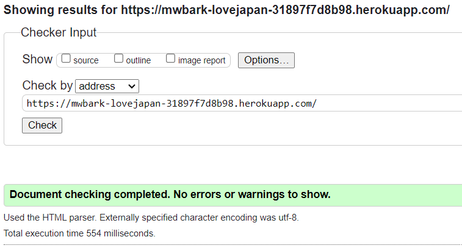

## Code Validation

### HTML

HTML code was tested using the [W3C Validator](https://validator.w3.org/) via text input.  The HTML code was copied and pasted in from each page of the website's source code.

Screenshots and results for all templates.

 

**HOME**

