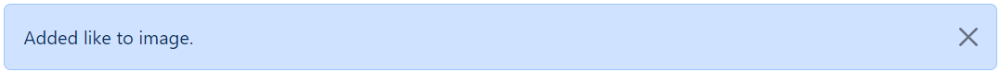
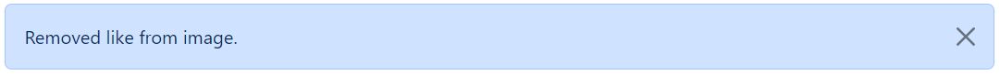
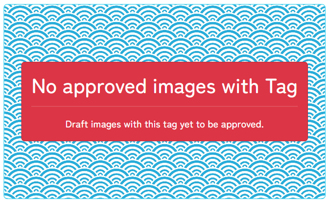

## Code Validation

### HTML

HTML code was tested using the [W3C Validator](https://validator.w3.org/) via URI.

Screenshots and results for all templates.

 

**HOME**

**IMAGE POST**

**PROFILE**

**PROFILE POSTS**

**DRAFT POSTS**

**TAGS LIST**

**TAG POSTS**

**UPLOAD IMAGE**

**NOTIFICATIONS**

**REGISTER**

**LOGIN**

**LOGOUT**

**ABOUT**

**CONTACT**

### CSS

CSS code was tested using the [W3C CSS Validation Service](https://jigsaw.w3.org/css-validator/) via text input. 

Screenshots with results for the styles.css file

### Javascript

Javascript code was tested using [JSHint](https://jshint.com/).

Screenshot with results for the imagepost.js file

the undefined variable of 'bootstrap' is caused by cross referencing scripts

### Python

### Lighthouse

### Responsivness

All webpages are responsive with the [Boostrap grid](https://getbootstrap.com/docs/5.3/layout/grid/) layout. The breakpoints of col-sm, col-md and col-lg where used respectivley for mobile, tablet and laptop screens

Home page examples

**HOME**

**TABLET**

**MOBILE**

### Browser Compatability

I have tested the website in Chrome, Firefox and Edge

### Manual Featrures Testing

List of all passed tests

**NAVBAR**

- Navigates to:

  - Home page when logo is clicked
  - Tags page when 'Tags' is clicked
  - Sign up page when 'Register' is clicked
  - Login page when 'Login is clicked
  - Logout page when 'Logout' is clicked
  - Upload page when 'Upload Image' is clicked
  - Notifiactions page when bell icon is clicked
  - Profile page when profile image icon is clicked
  - Search page when 'Search' button is clicked

- On mobile and tablet, opens as dropdown menu when burger button is clicked
- Displays different links based upon user authenticated status

 

**FOOTER**

- Navigates to:

  - About page when 'About' is clicked
  - Contact page when 'Contact' is clicked

 

**HOME**

- Displays only approved image posts
- Page navbar available when there are greater than 6 images
- Navigates to selected page when clicked

- Navigate to specific imagepost when image is clicked

 

**IMAGEPOST**

- Displays image card with:

  - Image
  - Working link to uploader's profile
  - Title
  - Thumbs up/down icon if liked/not liked
  - Message
  - Created on
  - Update button

- Click on image toggles fullscreen image modal
- Click on modal image exits modal
- Click on image thumbs up redirects to page with alert message:

- Click on image thumbs down redirects to page with alert message:

- Comments displayed with:

  - Working link to author's profile
  - Created on 

 

**TAGS**

- Displays all tags
- Navigates to specific tag when specific tag is clicked

 

**TAG POSTS**

- Displays all approved images with requested tag
- Displays card when no approved images yet with tag

- Navigate to specific imagepost when image is clicked

 

### Automated Testing