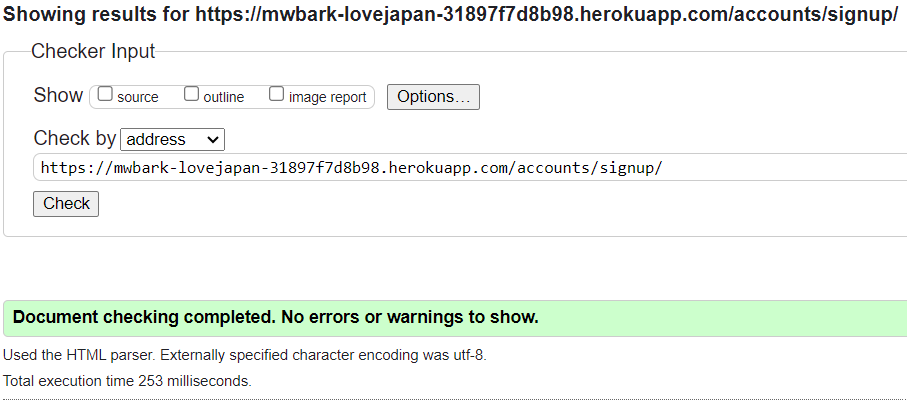

## Code Validation

### HTML

HTML code was tested using the [W3C Validator](https://validator.w3.org/) via URI.

Screenshots and results for all templates.

 

**HOME**

**IMAGE POST**

**PROFILE**

**PROFILE POSTS**

**DRAFT POSTS**

**TAGS LIST**

**TAG POSTS**

**UPLOAD IMAGE**

**NOTIFICATIONS**

**REGISTER**

**LOGIN**

**LOGOUT**

**ABOUT**

**CONTACT**

### CSS

CSS code was tested using the [W3C CSS Validation Service](https://jigsaw.w3.org/css-validator/) via text input. 

Screenshots with results for the styles.css file

### Javascript

Javascript code was tested using [JSHint](https://jshint.com/).

Screenshot with results for the imagepost.js file

the undefined variable of 'bootstrap' is caused by cross referencing scripts

### Python

### Lighthouse

### Responsivness

All webpages are responsive with the [Boostrap grid](https://getbootstrap.com/docs/5.3/layout/grid/) layout. The breakpoints of col-sm, col-md and col-lg where used respectivley for mobile, tablet and laptop screens

Home page examples

**HOME**

**TABLET**

**MOBILE**

### Browser Compatability

I have tested the website in Chrome, Firefox and Edge

### Manual Featrures Testing

List of all passed tests

**NAVBAR**

- Navigates to:

  - Home page when logo is clicked
  - Tags page when 'Tags' is clicked
  - Sign up page when 'Register' is clicked
  - Login page when 'Login is clicked
  - Logout page when 'Logout' is clicked
  - Upload page when 'Upload Image' is clicked
  - Notifiactions page when bell icon is clicked
  - Profile page when profile image icon is clicked
  - Search page when 'Search' button is clicked

- On mobile and tablet, opens as dropdown menu when burger button is clicked
- Displays different links based upon user authenticated status

**FOOTER**

- Navigates to:

  - About page when 'About' is clicked
  - Contact page when 'Contact' is clicked

**HOME**

- Displays only approved image posts
- Page navbar available when there are greater than 6 images
- Navigates to selected page when clicked

- Navigate to specific imagepost when image is clicked

**REGISTER**

- Displays account/signup.html with form
- Click link to 'sign in' navigates to login page
- Successful form submission redirects to home page with alert "Successfully signed in as username."

**LOGIN**

- Displays account/login.html with form
- Click link to 'sign up' navigates to register page
- Successful form submission redirects to home page with alert "Successfully signed in as username."

**LOGOUT**

- Displays account/logout.html
- Click on 'Sign Out' button redirects to home page with alert "You have signed out." 

**IMAGEPOST**

- Displays image card with:

  - Image
  - Working link to uploader's profile
  - Title
  - Thumbs up/down icon if liked/not liked
  - Message
  - Tags
  - Created on
  - Update and Delete button

- Click on image toggles fullscreen image modal
- Click on modal image exits modal
- Click on image thumbs up redirects to page with alert 'Added like to image.'
- Click on image thumbs down redirects to page with alert 'Removed like from image'.
- Click on on thumb icon while not logged in triggers alert 'You must be logged in to like.'
- Click on tag name navigates to related Tag Posts
- Click on Update button navigates to upload page with fields filled in with imagepost instance.
- Click on Delete button launces Delete model
- Click on Delete button in model triggers 'delete_post' and redircts
 to home with alert 'Image deleted!
- Comments displayed with:

  - Working link to author's profile
  - Created on
  - Message
  - Faded and 'This comment is awaiting approval' if draft and request.user is comment.author
  - Edit and Delete buttons if request.user is comment.author

- Click on edit button fill in 'body' field in 'Leave a comment section' and changes button to 'update' in form
- Click on 'Delete' launches Delete Modal with specfic text.
- Click on Delete in the Modal redirects to page with alert 'Comment deleted!'

- Filling in the 'body' of ImageCommentForm and clicking 'Submit' redirects to page with alert 'Comment submitted and awaiting approval'

**TAGS**

- Displays all tags
- Navigates to specific tag when specific tag is clicked

**TAG POSTS**

- Displays all approved images with requested tag
- Displays card with 'No approved images with Tag' when no approved images yet with tag
- Navigate to specific imagepost when image is clicked

**UPLOAD/EDIT IMAGE**

- Displays uploadimage.html with upload_image_form
- Successful form submission redirects to home with alert 'Your Image is awaiting approval'
- If name exists triggers alert 'Name already exists. Please choose an unique name.'
- If not valid image file triggers alert 'Not a valid image file!'
- If image is larger than 20mb triggers alert 'Image file to large!'

**PROFILE**

- Displays profile card with:

  - Profile image
  - Profile username
  - Profile bio
  - Joined date
  - Last login
  - If request.user is profile.user, Edit Profile button

- Click on Edit Profile button launches Profile Update Modal with profile form
- Run same image checks as for EDIT IMAGE
- Successful form submission redirects with alert 'Your Profile Has Been Updated'
- Displays list of approved profile image posts with links to specific image on click
- If request.user is profile.user, displays list of draft profile image posts with links to specific image on click
- If either list has 6 or more images, has link to respective profile posts and profile draft list views with 'Show all' link

**PROFILE IMAGE POSTS**

- Displays paginated list of approved image posts filtered by profile
- Click on image navigates to related image post

**PROFILE DRAFT POSTS**

- Displays paginated list of draft image posts filtered by profile
- Click on image navigates to related image post
- If request.user is not related profile.user to these drafts, raises 403 error.

**NOTIFICATIONS**

- Displays read and unread notifications
- Unread notifications have 'Mark as read' button
- Click on button redirects with alert 'Notification marked as read.'

**SEARCH**

- Displays heading with 'You searched for "searched input"
- Displays image posts related the searched input
- Click on image navigates to related image post
- Empty search displays heading 'No search entered!'
- If no image posts related to searched, displays card with 'No results for "searched"'

**ABOUT**

- Displays About Model rendered to about.html

**CONTACT**

- Displays both ContactInfo Model and ContactForm rendered to contact.html
- Successful form completion redirects with alert "Message sent! We'll get back to you ASAP."

**ADMIN**

- Displays all Models
- Full CRUD functionality over all models

**403, 404 & 500 ERRORS**

- Custom 403.html displays for unauthorised access to profile draft posts
- Custom 404.html displays for not found images, profile and tags
- Custom 500.html displays for server errors

### Automated Testing

- An attempt was made at automated testing, but due to a lack of time only a very limit number of automated test were carried out.